# Nasabah Web Service
 
# Using this project
1. Clone this repository: `git clone  https://github.com/codelamps-academy/bank-arzailants.git`
2. Navigate to the folder: `cd nasabah-webservice-app`
3. Replace Database Credentials with your own on `application.properties` file
4. Run app with spring boot: `mvn clean spring-boot:run`
5. Run with docker compose: `mvn clean package && docker compose up`
6. Open your favorite browser: http://localhost:8080 or using docker: http://localhost:8000

### Image Screen shots

Add New Nasabah

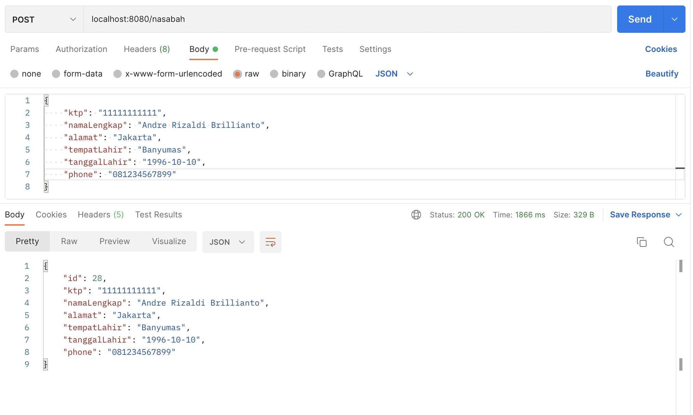
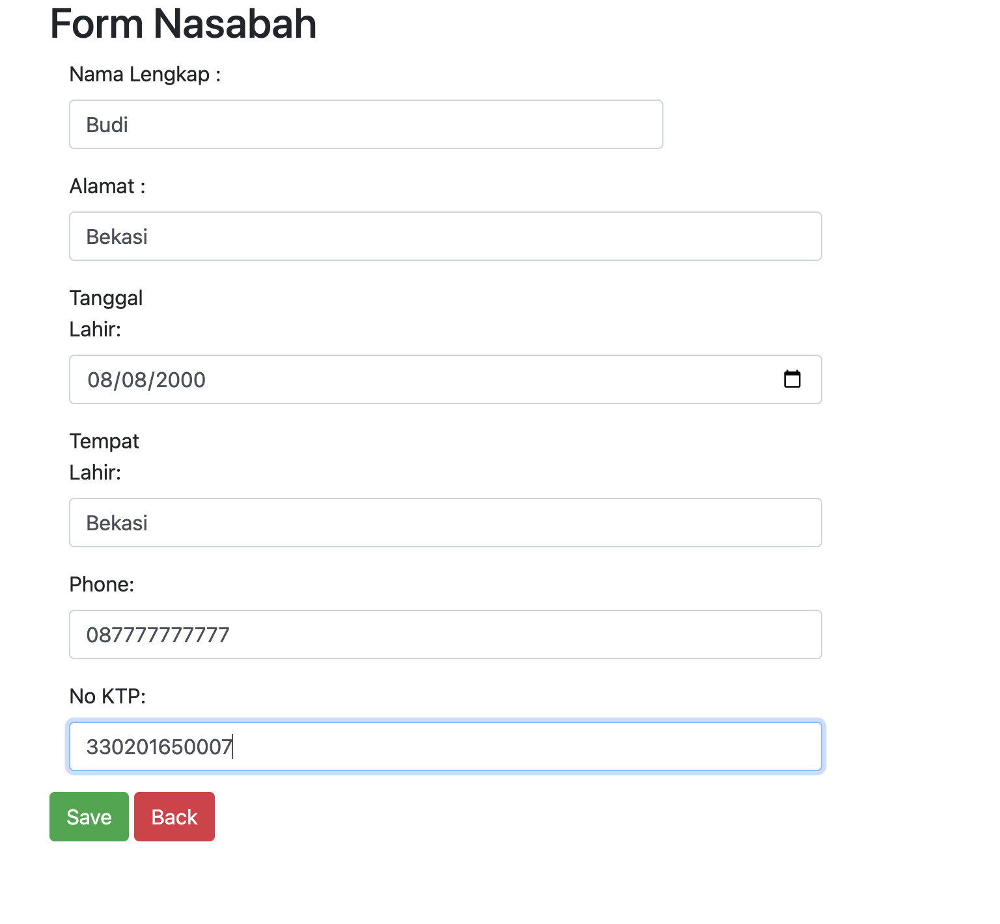

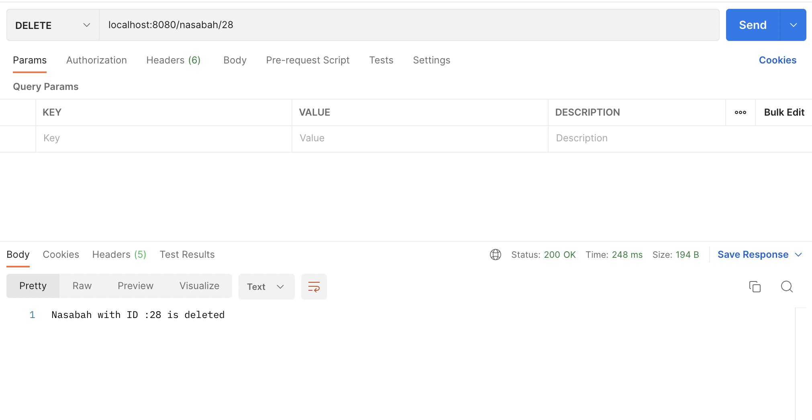
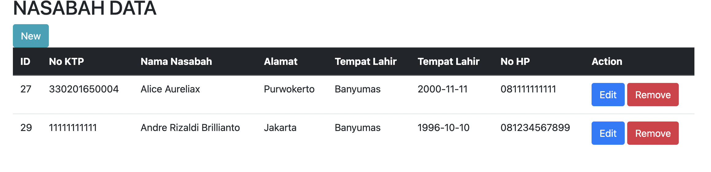

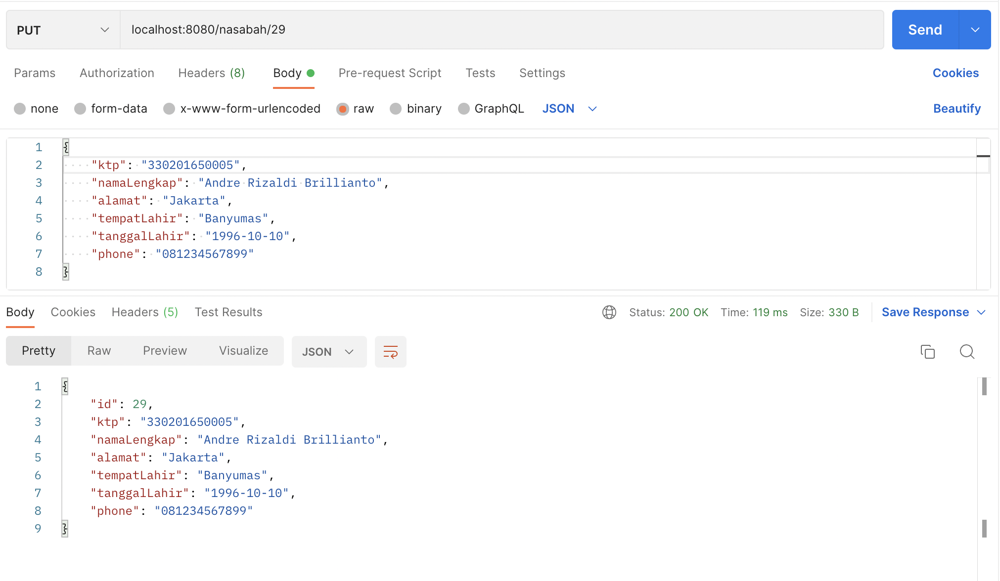
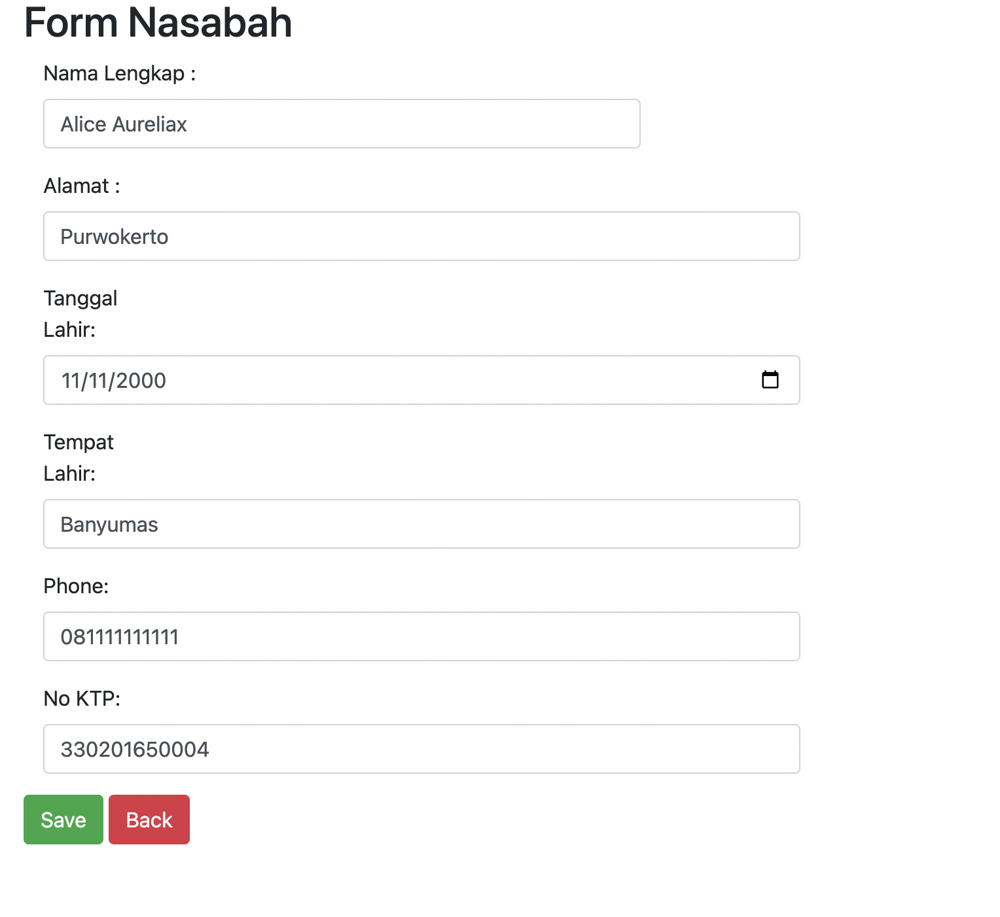

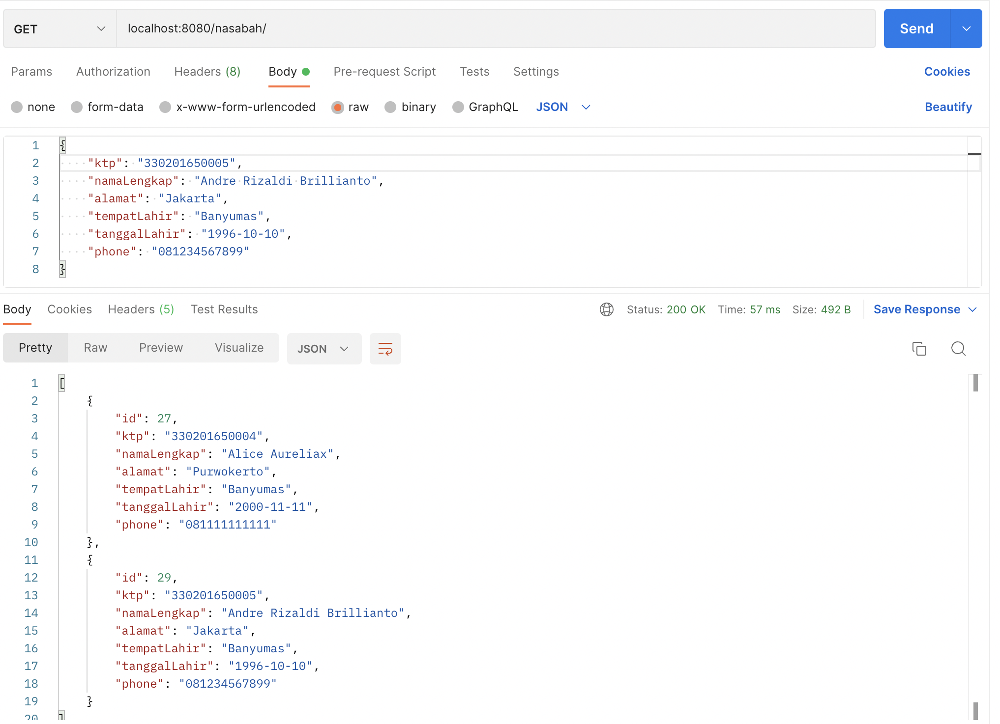
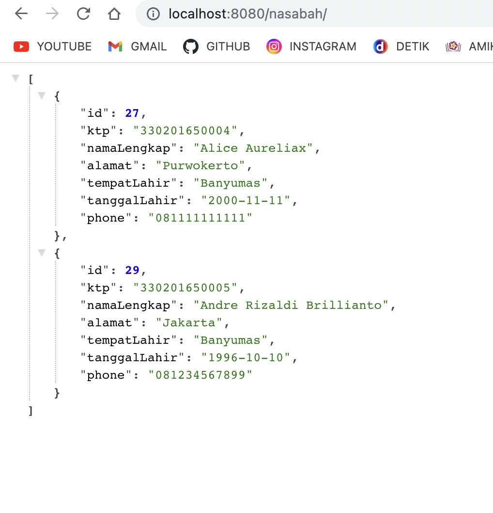

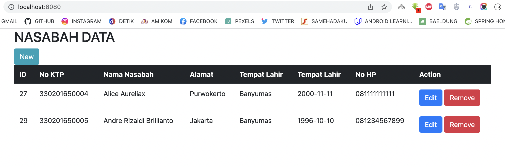

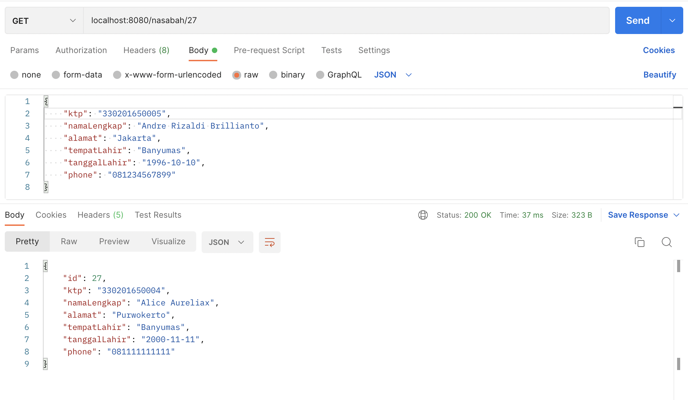
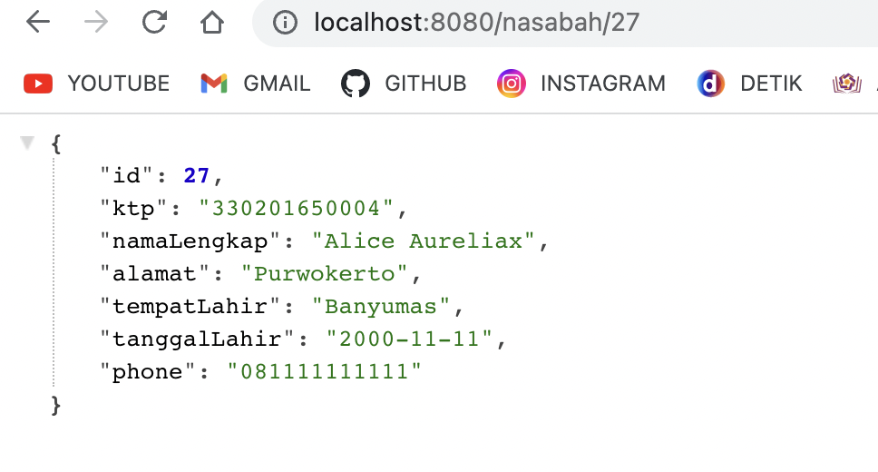

